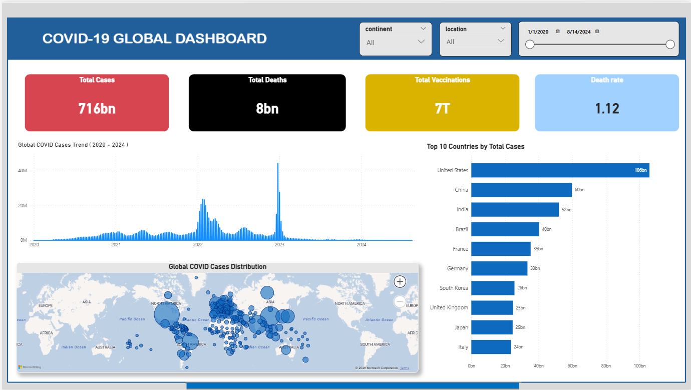

# 🦠 COVID-19 Global Data Analysis Dashboard

## 📌 Project Overview
This project focuses on analyzing global COVID-19 data using Python (Pandas) for data cleaning and preprocessing, and Power BI for interactive data visualization.

The goal of this project is to transform raw COVID-19 data into meaningful insights through data analysis and an interactive dashboard.

---

## 🛠️ Tools & Technologies Used
- Python (Pandas, NumPy)
- Jupyter Notebook / VS Code
- Power BI
- CSV Dataset

---

## 📂 Project Structure
- `clean_covid_data.csv` → Cleaned dataset
- `Covid-19.ipynb` → Data cleaning and preprocessing
- `COVID_19 Global DashBoard.pbix` → Power BI dashboard

---

## 📊 Dashboard Preview

---

## 🔍 Key Insights
- Total COVID-19 cases reached **716 billion+ globally**
- Total deaths recorded are around **8 billion**
- Vaccination count exceeded **7 trillion doses**
- The United States, China, and India reported the highest number of cases
- Significant spikes in cases observed during 2021–2023
- Global distribution shows higher concentration in densely populated regions

---

## 📈 Features of Dashboard
- Interactive filters (Continent, Location, Date range)
- KPI cards (Total Cases, Deaths, Vaccinations, Death Rate)
- Time-series analysis of COVID-19 cases
- Country-wise comparison (Top 10 countries)
- Global map visualization

---

## 🚀 Conclusion
This project demonstrates an end-to-end data analysis workflow:
- Data Cleaning → Data Analysis → Data Visualization

It highlights how raw data can be transformed into actionable insights using Python and Power BI.

---

## 🙌 Author
**SujithNadipalli**
